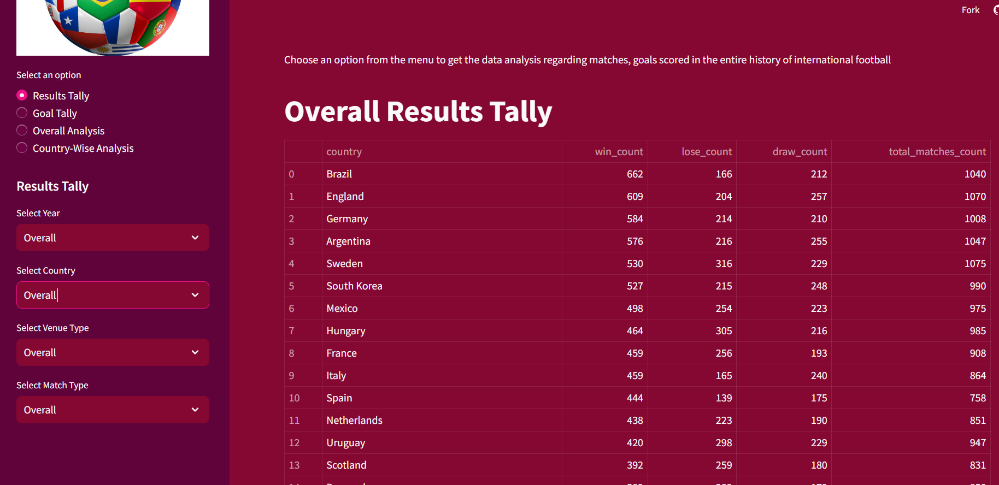
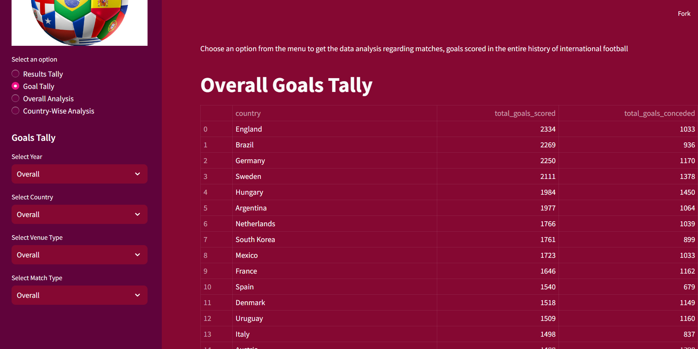
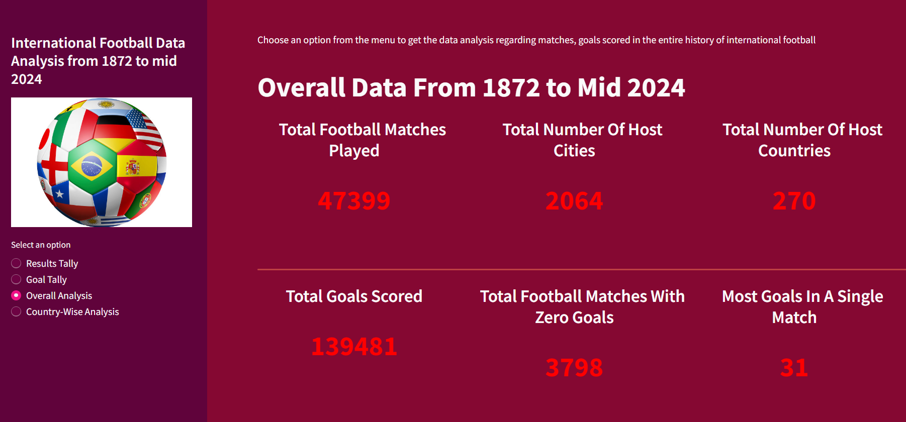
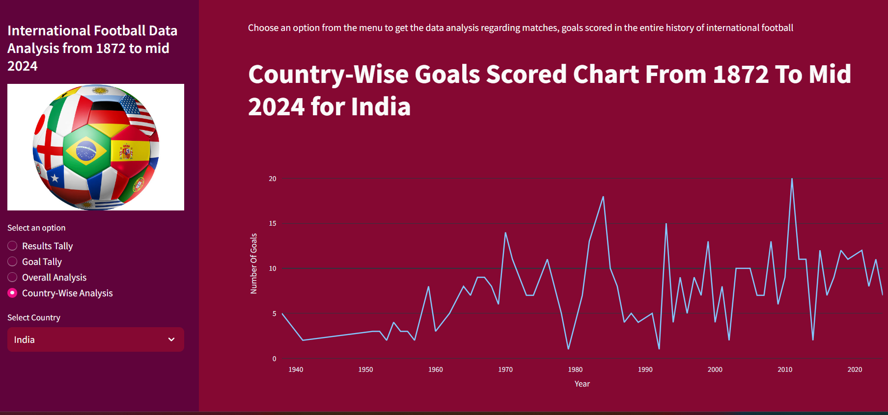

# International-football-data-analysis-using-python
 International Matches from 1872 to mid 2024 analyzed

i.) International Matches Dataset taken from Kaggle is used ('https://www.kaggle.com/datasets/martj42/international-football-results-from-1872-to-2017') to present the facts and figures of International Football throughout the history through interactive UI. Streamlit is used to build this website.

## These are the different pages of the app:





## To get started with this project,follow the steps mentioned below:
1. Clone the repository
```bash
git clone https://github.com/rishabhpancholi/International-football-data-analysis.git
cd International-football-data-analysis
```

2.Install dependencies
Install the following python packages using the following script-

```bash
pip install -r requirements.txt
```

3.Run the application through this command-

```bash
python app.py
```
